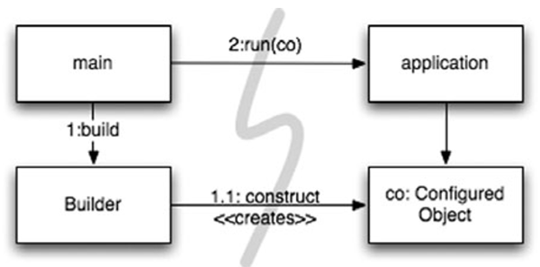
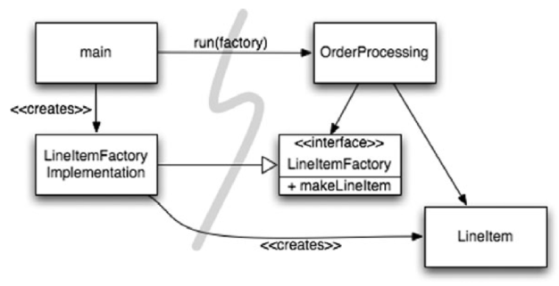
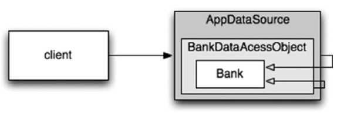

# Chapter 11 - Systems

A System is like a City. It is too much for one person to manage, so there are teams of people who manage particular parts of the city, the water systems, power systems, traffic, law enforcement, etc. Some of those people focus on the bigger picture while others focus on the details.

In other words, a city follows a **Separation of Concerns**.

## Separate Constructing a System from Using It

Software systems should separate the startup process, when the application objects are constructed and the dependencies are "wired" together, from the runtime logic that takes over after startup.

The **Separation of Concerns** is one of the oldest and most important design techniques in our craft. Startup is one concern, runtime is another one.

Let's have a look at this Service initialization code:

```java
public Service getService() {
    if (service == null)
        service = new MyServiceImpl(...);
    return service;
}
```

At first glance it looks fine, it uses Lazy Initialization idiom, checks for nullity, and only returns an object if we use it so it can make our program faster.

However, we now have a hard-coded dependency to `MyServiceImpl` and cannot start any other implementation of `Service`. We also have dependencies to everything `MyServiceImpl` requires and we need to resolve them at startup even if we don't use them at runtime!

### Methods to separate Startup and Runtime

<<<<<<< HEAD
#### Separation of Main

A first and simple way to separate construction from use is simply to move all aspects of construction to `main`, and to design the rest of the system assuming that all objects have been constructed and wired up appropriately.

The `main` function builds the objects necessary for the system, then passes them to the application, which simply uses them.

This means that the application has no knowledge of `main` or of the construction process. It simply expects that everything has been built properly.



#### Factories

Instead of instantiating at startup all the implementation needed at runtime, we only instantiate Factories and Builders in the Main.

Factories and Builders will be called at runtime with specific parameters and return the specific implementations needed for specific use cases.

If we need new implementation or to change the existing ones, we just modify the Factories and Builders code without touching the startup code.



#### Dependency Injection

Dependency Injection is the application of __*Inversion of Control*__ (IoC) to dependency management.

Just like Factories and Builders described in the previous section, IoC moves the responsibility for instantiating dependencies to dedicated mechanisms (thereby "inverting the control"). It could be the "Main" routine or a special-purpose __container__.

Some popular __containers__ : JNDI, EJB, Spring, ect.

JNDI example:

```java
MyService myService = (MyService)(jndiContext.lookup(“NameOfMyService”));
```

It's a "partial" implementation of DI, but here, a `jndiContext` object, which was instantiated at startup, asks a directory server to provide a "service" matching a particular name.

True DI goes one step further. The class takes no direct steps to resolve its dependencies; it's completely passive. Instead, it instantiates on demand the required objects and wire them using setter methods or constructor arguments. It can be done through a configuration file or programmatically in a special-purpose construction module.

The Spring Framework, for instance, do exactly this by using XML or Java configuration files, or using Java annotations.

### Cross-Cutting Concerns

Some old architectures, like EJB2, were not fully separating all the concerns. __Persistence__, for instance, used to be implemented directly in domain objects using specific Database management systems following naming conventions and transaction semantics. Even though the persistence strategy was modular and encapsulated, in practice, you had to spread the same code that implements the persistence strategy across many objects. Therefore, SRP was half implemented and we used to use the term cross-cutting concerns for concerns like these.

Using persistence as an example, you would declare which objects and attributes should be persisted and then __delegate the persistence tasks to your persistence framework__. The behavior modifications are made **noninvasively** to the target code using Aspect Oriented Programming framework.

### Evolution of AOP Framework

#### Java Proxies

Java Proxies use `InvocationHandler` objects which use the Java reflection API to map generic method invocations to the corresponding POJO method's implementations.

They make developers create huge volume of complex code.

#### EJBs

In EJBs, You must subclass container types and you must provide many lifecycle methods that are required by the container. Therefore, the business logic is tightly coupled to the EJB application “container”.

#### Spring

Pure Java AOP Frameworks like Spring or JBoss abstract all the wiring and application infrastructure for the developers. It allows them to focus on the business logic only. That's True Separation of Concerns!

You write your business logic as Plain-Old Java Objects. POJOs are purely focused on their domain. They have no dependencies on enterprise frameworks (or any other domains). Hence, they are conceptually simpler and easier to test drive. The relative simplicity makes it easier to ensure that you are implementing the corresponding user stories correctly and to maintain and evolve the code for future stories.

You incorporate the required application infrastructure, including cross-cutting concerns like persistence, transactions, security, caching, failover, and so on, using declarative configuration files or APIs. These declarations drive the dependency injection (DI) container, which instantiates the major objects and wires them together on demand.

Back to our Persistence example of earlier:

```xml
<beans>
    <bean id="appDataSource" class="org.apache.commons.dbcp.BasicDataSource" destroy-method="close" p:driverClassName="com.mysql.jdbc.Driver" p:url="jdbc:mysql://localhost:3306/mydb" p:username="me"/>
    <bean id="bankDataAccessObject" class="com.example.banking.persistence.BankDataAccessObject" p:dataSource-ref="appDataSource"/>
    <bean id="bank" class="com.example.banking.model.Bank" p:dataAccessObject-ref="bankDataAccessObject"/>
</beans>
```

Each “bean” is like one part of a nested “Russian doll,” with a domain object for a Bank proxied (wrapped) by a data accessor object (DAO), which is itself proxied by a JDBC driver data source.



## Testing

If you can write your application’s domain logic using POJOs, decoupled from any architecture concerns at the code level, then it is possible to truly test drive your architecture. You can evolve it from simple to sophisticated, as needed, by adopting new technologies on demand. *__It is not necessary to do a Big Design Up Front__* (BDUF). In fact, BDUF is even harmful because it inhibits adapting to change, due to the psychological resistance to discarding prior effort and because of the way architecture choices influence subsequent thinking about the design.

> An optimal system architecture consists of modularized domains of concern, each of which is implemented with Plain Old Java (or other) Objects. The different domains are integrated together with minimally invasive Aspects or Aspect-like tools. This architecture can be test-driven, just like the code.

## Scaling up

Like Cities, Systems grow and evolve. How can we make sure it is correctly built so it can scale without pain?

Should we build a six-lane highway in a small town to anticipate its growth to a big city?

Should we build a software system in anticipation of how big it can grow?

It is a myth that we can get systems “right the first time.” Instead, we should implement only today’s stories, then refactor and expand the system to implement new stories tomorrow. This is the essence of iterative and incremental agility. Test-driven development, refactoring, and the clean code they produce make this work at the code level.

> Software systems are unique compared to physical systems. Their architectures can grow incrementally if we maintain the proper separation of concern.

Be careful of overengineering!

## Be careful of Standards

Standards make it easier to reuse ideas and components, recruit people with relevant experience, encapsulate good ideas, and wire components together. However, **the process of creating standards can sometimes take too long for industry to wait**, and some standards lose touch with the real needs of the adopters they are intended to serve.

E.g. EJBs

## Domain-Specific Languages

Experts all have their specific vocabulary, idioms and patterns. It can be the same for a System.

**Domain-Specific Languages** (DSL) are separate, small scripting languages or APIs in standard languages that permit code to be written so that it reads like a structured form of prose that a domain expert might write.

A good DSL minimizes the *__communication gap__* between a domain concept and the code that implements it, just as agile practices optimize the communications within a team and with the project’s stakeholders. There is less risk that you will incorrectly translate the domain into the implementation.

> Domain-Specific Languages allow all levels of abstraction and all domains in the application to be expressed as POJOs, from high-level policy to low-level details.

## Conclusion

Systems must be clean too. An invasive architecture overwhelms the domain logic and impacts agility. When the domain logic is obscured, quality suffers because bugs find it easier to hide and stories become harder to implement. If agility is compromised, productivity suffers and the benefits of TDD are lost.

**Whether you are designing systems or individual modules, never forget to use the simplest thing that can possibly work.**
